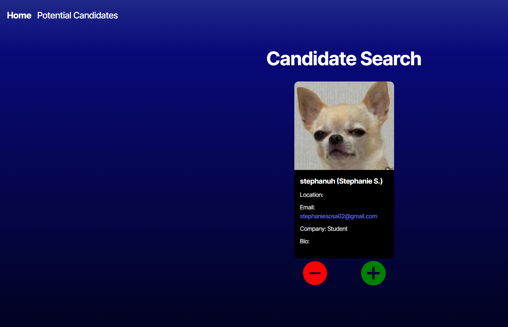
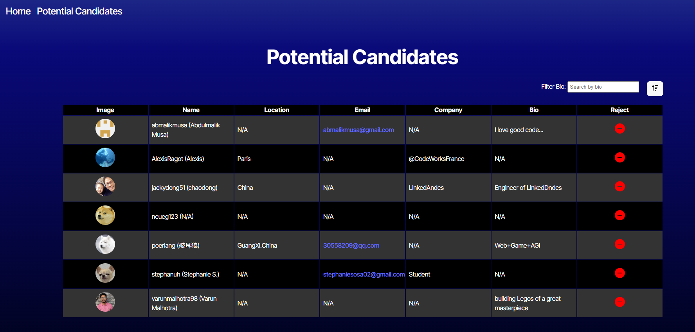

# Candidate-search-Application 🧑‍💻
## Description
A web application that fetches GutHub users and displays them as potential candidates. Users can browse through profiles, save candidates, and filter by bio.

[Click here]() to see the action!

## Installation
For installation follow these steps:
1) Create a GitHub Personal Access Token. 
2) Add token you've created to an **.env file** in the environment folder as `VITE_GITHUB_TOKEN=INSERT_TOKEN_HERE`
3) install dependencies `npm install`
4) Run the application with `npm run dev`

## Usage
- Run `npm run dev` in your terminal and it will take you to the application website.
- You can search and display random GitHub users as potential candidates.
- Save candidates to local storage for future reference.
- Filter candidates by bio content

It will look like the following photos below: 

 

## Credits
 For creating my Token I followed the instructions on this link [here](https://docs.github.com/en/authentication/keeping-your-account-and-data-secure/managing-your-personal-access-tokens#creating-a-fine-grained-personal-access-token)

## License
This project is licensed under 

## Contact📧 
If you have any quesations or want to reach out contact me on GitHub: [stephanuh](https://github.com/stephanuh)